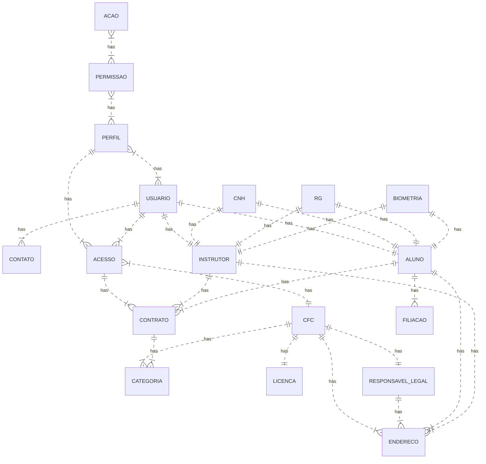

```mermaid
    erDiagram
        ACAO }|..|{ PERMISSAO : has
        PERMISSAO }|..|{ PERFIL : has
        PERFIL }|..|{ USUARIO : has
        USUARIO ||..|{ CONTATO : has
        PERFIL ||..|{ ACESSO : has
        USUARIO ||..|{ ACESSO : has
        ACESSO }|..|| CFC : has
        CFC ||..|{ CATEGORIA : has
        CFC ||..|| LICENCA : has
        CFC ||..|| RESPONSAVEL_LEGAL : has
        CFC ||..|{ ENDERECO :has
        RESPONSAVEL_LEGAL ||..|{ ENDERECO :has
        ALUNO ||..|{ ENDERECO :has
        INSTRUTOR ||..|{ ENDERECO :has
        ACESSO ||..|{ CONTRATO : has
        CONTRATO ||..|{ CATEGORIA : has
        INSTRUTOR ||..|{ CONTRATO : has
        ALUNO ||..|{ CONTRATO : has
        USUARIO ||..|| INSTRUTOR : has
        USUARIO ||..|| ALUNO : has
        ALUNO ||..|{ FILIACAO : has
        CNH ||..|| INSTRUTOR :has
        CNH ||..|| ALUNO :has
        RG ||..|| INSTRUTOR :has
        RG ||..|| ALUNO :has
        BIOMETRIA ||..|| INSTRUTOR :has
        BIOMETRIA ||..|| ALUNO :has
```