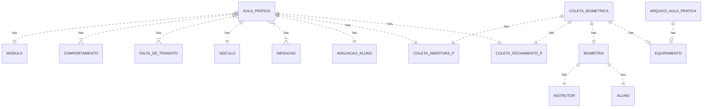

```mermaid
    erDiagram
        AULA_PRATICA ||..|| MODULO :has
        AULA_PRATICA }|..|{ COMPORTAMENTO :has
        AULA_PRATICA }|..|{ FALTA_DE_TRANSITO :has
        AULA_PRATICA ||..|| VEICULO :has
        AULA_PRATICA }|..|{ INFRACAO :has
        AULA_PRATICA ||..|| AVALIACAO_ALUNO :has
        AULA_PRATICA ||..|| COLETA_ABERTURA_P :has
        AULA_PRATICA ||..|| COLETA_FECHAMENTO_P :has
        COLETA_BIOMETRICA ||..|| COLETA_ABERTURA_P :has
        COLETA_BIOMETRICA ||..|| COLETA_FECHAMENTO_P :has
        COLETA_BIOMETRICA ||..|| BIOMETRIA :has
        BIOMETRIA ||..|| INSTRUTOR :has
        BIOMETRIA ||..|| ALUNO :has
        COLETA_BIOMETRICA ||..o| EQUIPAMENTO :has
        ARQUIVO_AULA_PRATICA ||..o| EQUIPAMENTO :has
```