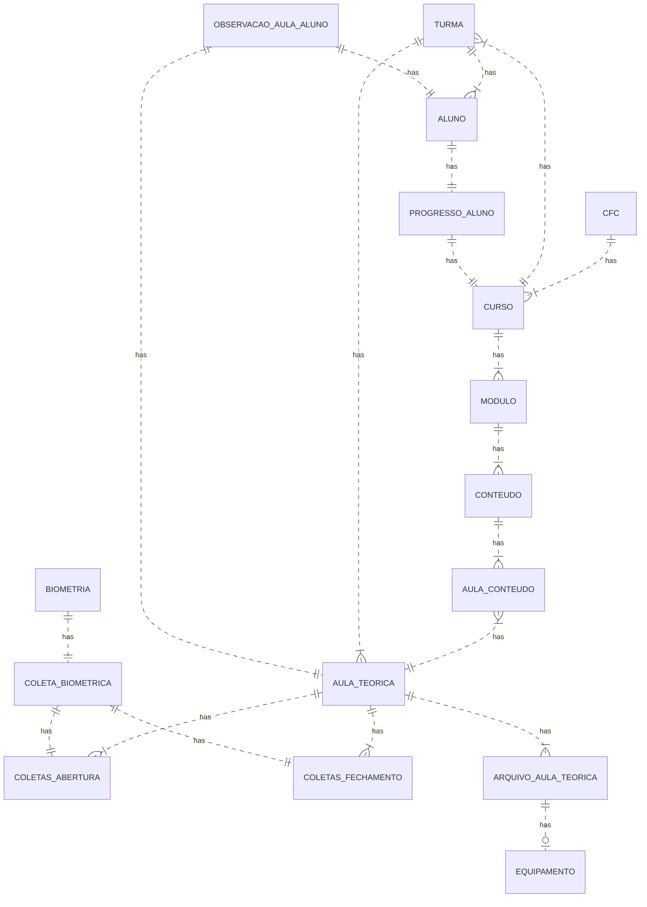

```mermaid
    erDiagram
        CFC ||..|{ CURSO : has
        CURSO ||..|{ MODULO : has
        MODULO ||..|{ CONTEUDO : has
        CONTEUDO ||..|{ AULA_CONTEUDO :has
        AULA_CONTEUDO }|..|| AULA_TEORICA :has
        TURMA }|..|| CURSO :has
        TURMA ||..|{ AULA_TEORICA :has
        TURMA ||..|{ ALUNO :has
        ALUNO ||..|| PROGRESSO_ALUNO :has
        PROGRESSO_ALUNO ||..|| CURSO :has
        OBSERVACAO_AULA_ALUNO ||..|| ALUNO :has
        OBSERVACAO_AULA_ALUNO ||..|| AULA_TEORICA :has
        AULA_TEORICA ||..|{ COLETAS_ABERTURA :has
        AULA_TEORICA ||..|{ COLETAS_FECHAMENTO :has
        COLETA_BIOMETRICA ||..|| COLETAS_ABERTURA :has
        COLETA_BIOMETRICA ||..|| COLETAS_FECHAMENTO :has
        BIOMETRIA ||..|| COLETA_BIOMETRICA :has
        AULA_TEORICA ||..|{ ARQUIVO_AULA_TEORICA :has
        ARQUIVO_AULA_TEORICA ||..o| EQUIPAMENTO :has
```